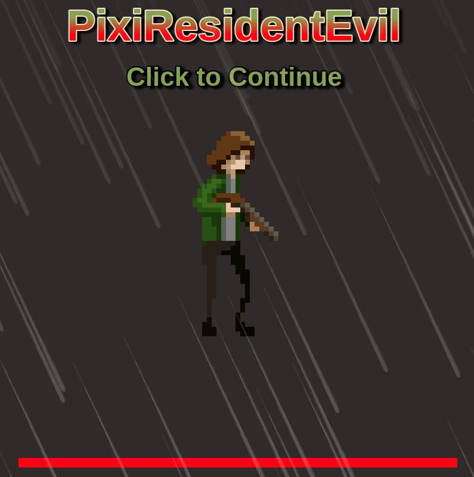
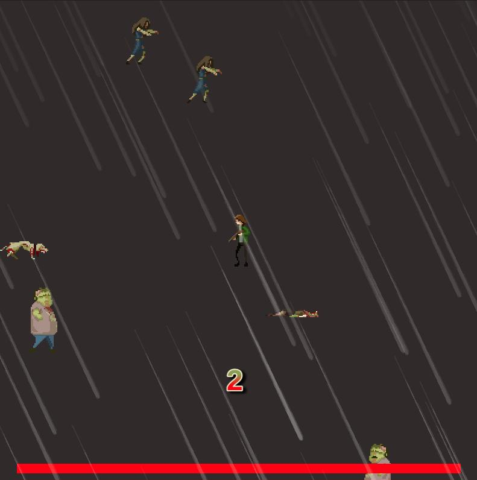
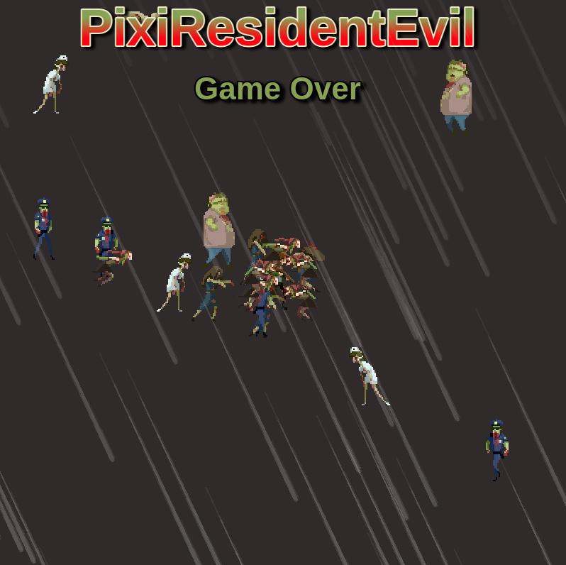

## PixiResidentEvil
The game created using `HTML5` `PixiJS` `TypeScript`.

## Demo
Click on the poster and to see a demo

## Screenshots
|  |  |
|-------------------------------------|-------------------------------------|

## Game Features

- Health bar for the player
- Fast zombies
- Score to check your achievements
- Theme music and custom sounds
- Sprite animation
    - zombie walking
    - player animation
    - weather raining
- Fun to play :)

## Controls
|              | Mouse  only            |
|--------------|------------------------|
| Fire         | <kbd>Left button</kbd> |

## How to play
- Online:
    - Go to [this link](https://petrischakmaxim.github.io/space-shooter/)
- Locally:
    - Clone this repository
    - Install dependencies `npm i`
    - Start webpack watcher `npm run watch`
    - Start local web server
  