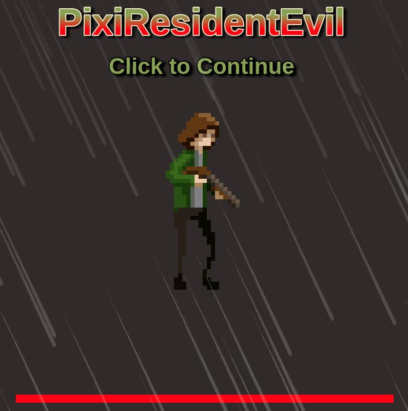
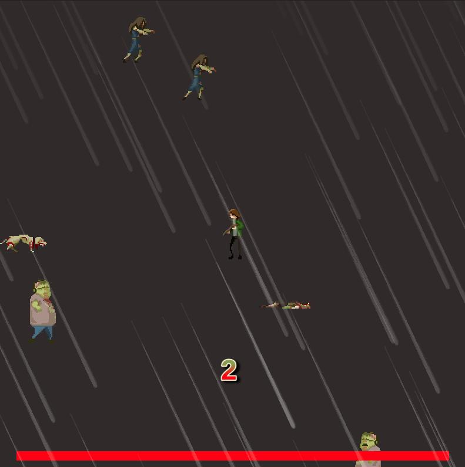
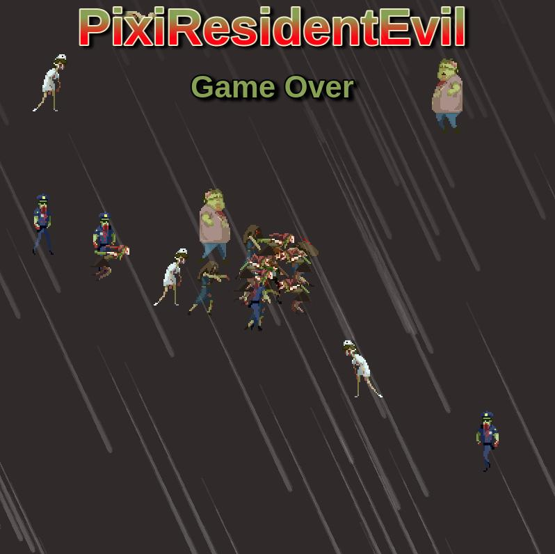

# Zombie Horde Game

A browser-based action game built with PixiJS and TypeScript, featuring a fast-paced zombie survival scenario with particle effects, animated sprites, and interactive shooting controls.

## Features
- PixiJS rendering with animated sprite sheets for enemies and player characters
- Player shooting using mouse input with responsive aiming
- Zombie wave gameplay with score tracking and health management
- Particle and weather effects powered by `pixi-particles`
- Live development workflow via Webpack and TypeScript

## Tech Stack
- `PixiJS` for 2D rendering
- `TypeScript` for typed game logic
- `Webpack` for bundling and development server
- `matter-js` for physics utility support
- `pixi-particles` for particle effects
- `Victor` for vector math

## Demo
Click the poster to view the demo:
[](https://youtube.com/shorts/BTKPSErxSFs)

## Screenshots
|  |  |
|-------------------------------------|-------------------------------------|

## Controls
| Action | Input |
|--------|-------|
| Fire   | Left mouse button |

## Installation
1. Clone the repository
2. Install dependencies:
```bash
npm install
```
3. Start the development server:
```bash
npm run serve
```
4. Open the browser when the local dev server launches

## Project Purpose
This project is a frontend game prototype built to demonstrate modern browser game development with PixiJS, TypeScript, asset management, and a Webpack-based workflow.

## Notes
- Designed as an experimental game demo rather than a production release.
- Good candidate for expanding with additional enemy behavior, level progression, and sound design.

  